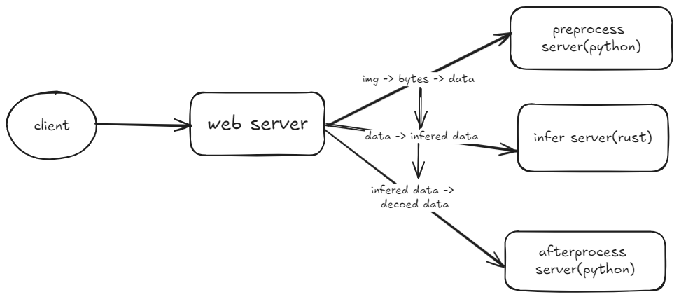

# 图片识别服务
## 使用 rust + python + grpc + RESTFUL 实现图片识别服务

### 1. python 的依赖包
#### tensorflow、pillow、grpcio-tools、protobuf（版本需要 3.20.*）

#### 2. 启动
```shell
# 1. 启动 python process 服务
python pyts/process_server.py
# 2. 启动 rust infer 服务
cargo run --bin infer_server
# 3. 启动 rust web 服务
cargo run --bin infer_client
```

#### 3. 访问 localhost:3000 上传图片查看结果